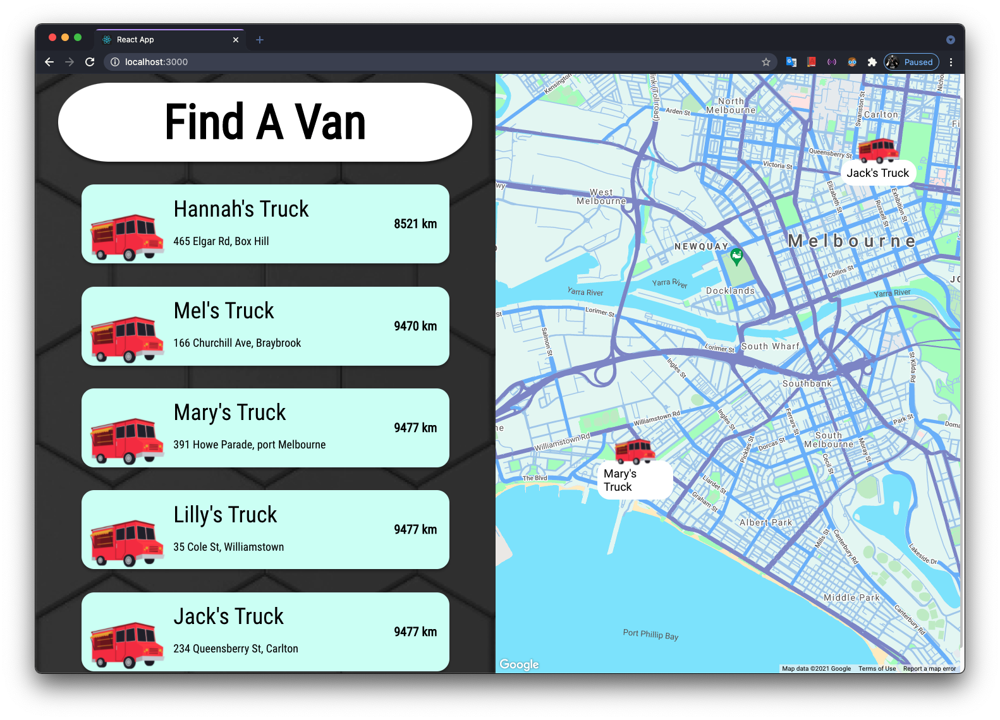

# Runtime Terror Front-end Repository
## INFO30005 Deliverable 3 - Frontend + Backend (Customer App)

 

## Team: Runtime Terror

### Tutor: Xiao Han

### Tutorial day and time: Wednesday 11 am

### Team number: 13

### Team Members:

| Name     | Student ID | Email                               | Working On |
| -------- | ---------- | ----------------------------------- | ---------- |
| Kaif     | 1068214    | kahsan@student.unimelb.edu.au       | Back-end   |
| Kamyar   | 1068176    | kkarimifakhr@student.unimelb.edu.au | Front-end  |
| Keith    | 1118943    | kleonardo@student.unimelb.edu.au    | Back-end   |
| Hasan    | 1118853    | sohi@student.unimelb.edu.au         | Front-end  |
| Mitchell | 823604     | mneedham@student.unimelb.edu.au     | Back-end   |

## Tech Stack

- Front-end
  - Figma
  - CSS
  - React Native
  - Bootstrap

- Back-end
  - Node.js
  - MongoDB
  - Heruko
  

### Heruko URL
Link: https://info30005-customer-frontend.herokuapp.com/

### Example Login Credentials
| Email | Password|
| --- | --- |
|k@gmail.com|admin123|
|jsmith@jmail.com|12345|

### Example Screenshots of various pages

**Home Page**: Lists nearest 5 vans and displays those on Google map. If the customer doesn't share location then Homepage will show the default page overlooking Melbourne CBD.
    

**Login Page**: Clicking the login button on home page will redirect to the login page. Example login credentials can be used form above or registered in the customer back-end from [this link](https://info30005-customer-backend.herokuapp.com/api/customer/register)
     

### Other Information:
-   Icon and logo images taken from [unsplash](https://unsplash.com/) and [canva](https://www.canva.com/)
-   Back-end repository link: https://github.com/INFO30005-2021-SM1/project-frontend-t13-runtime-terror
